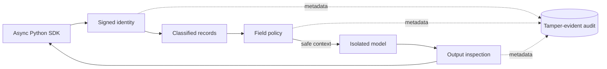

# Aegis Gateway

[](https://github.com/sophianggan/aegis-gateway/actions/workflows/ci.yml)
[](pyproject.toml)
[](LICENSE)

A policy-enforced AI gateway for teams that need useful model-assisted answers without
letting restricted data cross a trust boundary.

Most AI demos prove that a model answered. Aegis proves what the model was allowed to
see, checks what came back, and leaves a verifiable decision trail.



## What it demonstrates

- **Mandatory field-level access control** using ordered clearance, compartments, and a
  non-exportable override.
- **A hard model boundary** that constructs a fresh context from authorized values only.
- **Prompt-injection quarantine** at both user ingress and untrusted retrieved content.
- **Fail-closed response inspection** for filtered values, credentials, tokens, private
  keys, and identifiers.
- **Tamper-evident audit trails** using append-only PostgreSQL rows and HMAC hash chains.
- **A clean developer surface** through FastAPI, generated OpenAPI docs, and an async,
  typed Python SDK.
- **Reproducible operations** with an offline deterministic provider, Docker Compose,
  hardened Kubernetes manifests, structured payload-free logging, and operator tooling.
- **Security as a build gate** with unit, integration, negative, and red-team tests that
  fail on both leakage and excessive refusal.

## Run the zero-infrastructure demo

Python 3.11 or newer is required.

```bash
python -m venv .venv
source .venv/bin/activate
python -m pip install -e '.[dev]'
python examples/quickstart.py
```

The demo loads synthetic records in memory. The caller can see internal and compartmented
operational fields, while a non-exportable access value is filtered before model input.
It then verifies the completed request's audit chain.

## Run the durable stack

```bash
cp .env.example .env
docker compose up --build -d
docker compose run --rm gateway aegis seed
TOKEN=$(docker compose run --rm gateway aegis token \
  --subject demo-user --clearance CONFIDENTIAL --compartment operations)
```

Query one of the seeded record IDs:

```bash
curl --fail-with-body http://localhost:8080/v1/query \
  -H "Authorization: Bearer ${TOKEN}" \
  -H 'Content-Type: application/json' \
  -d '{
    "query": "Which inspection is due?",
    "record_ids": ["11111111-1111-4111-8111-111111111111"],
    "purpose": "maintenance planning"
  }'
```

Interactive OpenAPI documentation is served at `http://localhost:8080/docs`.

## SDK

```python
from aegis_sdk import AegisClient

async with AegisClient("https://gateway.internal", token) as client:
    result = await client.query(
        "Summarize open maintenance items",
        record_ids=["11111111-1111-4111-8111-111111111111"],
        purpose="weekly operations review",
    )
    print(result.answer)
    print(result.filtered_field_count)
```

Tokens are expected to be short-lived. The SDK also accepts an async token provider so an
application can refresh identity without recreating the client.

## Security model in one minute

The caller never submits its own clearance. A signed token resolves a principal; the
gateway checks revocation, fetches requested records, and evaluates every field. Only a
newly constructed allowlist context crosses the model boundary. High-confidence control
instructions inside that context are quarantined. The response is scanned against values
that were filtered plus structured credential patterns. Any finding blocks the complete
response. Audit events store counts and decisions, never prompts or record values.

Read [the architecture](docs/architecture.md), [the threat model](docs/threat-model.md),
and [the operations runbook](docs/runbook.md) for the full reasoning and residual risks.

## Quality gates

```bash
make lint
make test
pytest -m redteam tests/redteam
docker build -t aegis-gateway:local .
```

The current suite contains 69 tests and enforces at least 85% branch-aware coverage. CI
also performs dependency auditing and an immutable container build.

## Repository map

```text
src/aegis/             gateway domain, services, adapters, API, and CLI
src/aegis_sdk/         async typed client
migrations/            append-only PostgreSQL schema and least-privilege roles
tests/redteam/          injection, exfiltration, and over-refusal security gate
deploy/kubernetes/     hardened workload, scaling, and network policy
docs/                  architecture, threat model, and operating procedures
examples/              executable local demonstration
```

## Design choices

- The deterministic provider makes evaluation possible without network access or sending
  data to a third party.
- Model providers implement a narrow protocol; a compatible isolated endpoint can be
  selected by configuration.
- In-memory and PostgreSQL adapters share the same service path, preventing a simplified
  demo from bypassing production controls.
- The gateway refuses to silently redact a leaked answer. A blocked response is safer and
  more observable than returning partially trusted text.

This is a reference implementation, not a compliance certification. Adapt classification,
identity, retention, and review controls to the environment in which it is deployed.

