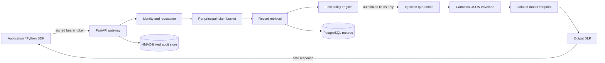

# Architecture

## Goal

Aegis places a mandatory policy boundary between sensitive records and a model endpoint.
The model is never trusted to decide what it may see, and its output is never trusted
until it passes independent inspection.

## Request invariants

The authorized context is also constrained by a deterministic byte budget. Fields are
considered in stable name order; anything beyond `AEGIS_MAX_CONTEXT_BYTES` is filtered
before model invocation and represented only as counts in the audit trail.

1. Identity is derived only from a validated, signed token. Client-supplied body fields
   cannot change clearance, compartments, or roles.
2. Revocation is checked before retrieval.
3. Per-principal limits are evaluated from trusted identity, never a client-selected key.
4. Every field must satisfy clearance, compartment, and exportability policy before it
   enters the model context.
5. Retrieved text is inert data. Fields containing high-confidence control instructions
   are quarantined before prompt assembly.
6. Prompt assembly uses a canonical JSON envelope with a fixed system boundary.
7. Model output is checked for protected values and structured credentials. A finding
   blocks the entire response.
8. Each hop records payload-free metadata in an append-only, HMAC-linked event chain.

## Components

### Domain and policy

`Classification` is an ordered lattice: public, internal, confidential, and restricted.
A field is visible when the principal's clearance dominates the field classification,
the principal holds every required compartment, and the field is exportable. A single
record can therefore produce an allow, filter, or deny decision.

### Ports and adapters

The service layer depends on protocols for records, audit events, token revocation, and
model completion. In-memory adapters make security tests deterministic. PostgreSQL and
HTTP adapters handle production boundaries without leaking infrastructure concerns into
policy code.

### Audit integrity

Each event includes the prior event hash. The current hash is an HMAC-SHA256 signature of
canonical event JSON, including that prior hash. PostgreSQL prevents updates and deletes;
the signature chain additionally detects forged direct inserts, reordering, or mutation.
The signing key must live in a managed secret store outside the database.

Verified chains can be exported as signed bundles. The bundle signature covers the exact
event list, request ID, generation time, count, and chain head, making evidence portable
without weakening the database's append-only controls.

### Failure model

Authorization, inspection, and upstream parsing fail closed. An unavailable model never
causes an uninspected fallback. Audit records intentionally contain counts, stable codes,
and resource identifiers rather than prompts, record values, tokens, or model output.

## Scale and availability

PostgreSQL deployments coordinate fixed-window quotas through pseudonymous HMAC identity
keys, so a caller cannot evade limits by reaching another replica and raw identities are
never stored in the quota table. Memory deployments retain the local token bucket.

Gateway processes are stateless when PostgreSQL is enabled. The Kubernetes deployment
starts with three replicas, has a disruption budget, and scales horizontally on CPU.
Database connections are pooled per process. Model requests carry an idempotency key so a
compatible internal provider can safely deduplicate retries at its boundary.

The private cloud reference uses an internal TLS load balancer, private Fargate tasks,
multi-AZ encrypted PostgreSQL, digest-pinned images, autoscaling, deployment rollback, and
separate execution/task identities. It consumes existing private networking rather than
silently creating internet-facing paths.

## Extension points

- Replace symmetric development JWT validation with an OIDC/JWKS authenticator.
- Add a policy-as-code adapter while preserving `PolicyEngine` decision contracts.
- Send HMAC chain heads to immutable object storage or an external transparency service.
- Add an approved embedding/retrieval adapter behind `RecordRepository`.
- Introduce tenant keys and row-level security for multi-tenant operation.
